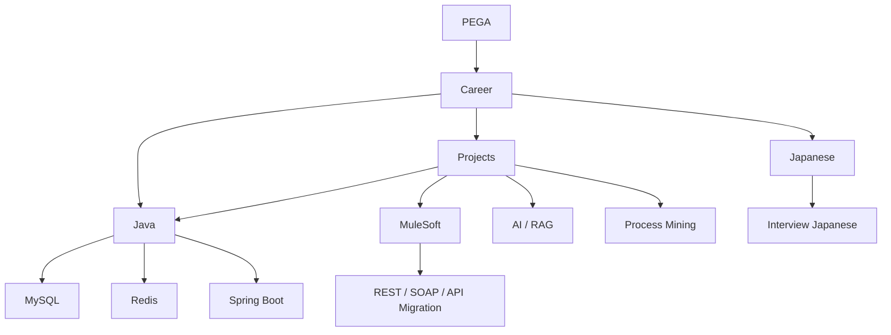

---
tags:
  - dashboard
  - knowledge-base
aliases:
  - Home
  - Knowledge Dashboard
---

# 🧠 Career Training Knowledge Base

> 这是整个 Obsidian Vault 的入口。目标不是把资料“存起来”，而是把学习、项目、面试和职业能力连接起来。

## 📘 Collaboration Rules

- [[KNOWLEDGE_RULES|Zhou Knowledge Base 协作规则]]

> 新窗口或任何“整理到知识库”的任务，优先以协作规则、相关 MOC、Master 和现有知识文件为准。

## 🎯 Current Focus

- [[Java/Java_MOC|Java Backend & Interview]]
- [[Japanese/Japanese_MOC|Japanese / N2 / Interview]]
- [[PEGA/PEGA_MOC|PEGA CPSA]]
- [[MuleSoft/MuleSoft_MOC|MuleSoft & API Integration]]
- [[Projects/Projects_MOC|Projects & Real Experience]]

## 🧭 Knowledge Maps

### 💻 Engineering
- [[Java/Java_MOC|Java]]
- [[MuleSoft/MuleSoft_MOC|MuleSoft]]
- [[PEGA/PEGA_MOC|PEGA]]
- [[IBM-Process-Mining/IBM_Process_Mining_MOC|Process Mining]]
- [[Projects/Projects_MOC|Projects]]

### 🌏 Language
- [[Japanese/Japanese_MOC|Japanese]]
- [[English/English_MOC|English]]

### 🚀 Career
- [[01-Career/Career_MOC|Career & Interview]]
- [[01-Career/Skill_Matrix|Skill Matrix]]

## 🔗 Core Knowledge Connections

## 📌 Working Rules

1. **Master**：长期稳定知识，只保留以后还会复习的内容。
2. **Daily / Notes**：当天训练、草稿、过程记录。
3. **WrongAnswers**：错误、薄弱项、容易混淆的内容。
4. **MOC**：Map of Content，负责把相关知识连接起来。
5. 每篇长期知识笔记尽量包含 `Related` 区域，至少连接 2 个相关主题。
6. 不为了 Graph 好看而滥用标签，优先使用真正有意义的 `[[双链]]`。
7. 详细规则以 [[KNOWLEDGE_RULES]] 为准。

## 🏷 Recommended Tags

- `#area/java`
- `#area/japanese`
- `#area/mulesoft`
- `#area/pega`
- `#area/process-mining`
- `#type/master`
- `#type/daily`
- `#type/wrong-answer`
- `#type/project`
- `#status/learning`
- `#status/review`
- `#status/mastered`

## 🗂 Templates

- [[99-Templates/Knowledge_Note_Template|Knowledge Note]]
- [[99-Templates/Daily_Learning_Template|Daily Learning]]
- [[99-Templates/Project_Note_Template|Project Note]]

---

### Graph 使用建议

打开 Obsidian 的 **Graph View** 后，优先观察 Java、Japanese、MuleSoft、PEGA、Projects 这几个知识簇之间是否形成真实连接。知识图谱的目标是帮助复习和调用，不只是视觉效果。
