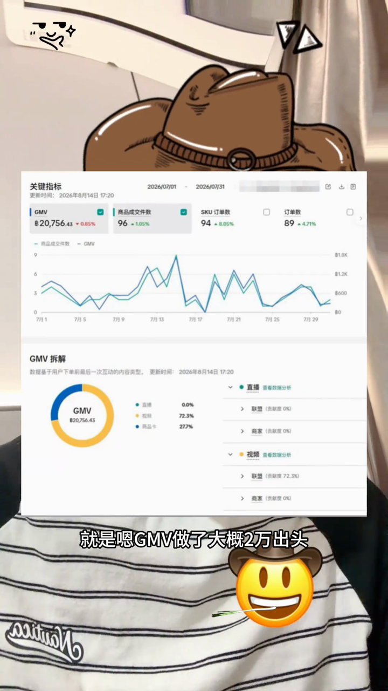

<!-- video-kb:generated; edits are preserved by conflict detection -->

# 7月数据与广告测品

[为自己打工的跨境赛道日记](../%E4%BD%9C%E8%80%85%E7%BB%8F%E5%8E%86.md) · [原视频](https://www.douyin.com/video/7673840886707240057)

[[CrossBorder/Cases/douyin-f2d4a8355145739d684a/作者经历|作者经历]]

## 摘要

画面显示2026年7月GMV为20,756.43泰铢、89订单。作者重新认识广告的试错作用，不能把GMV当人民币收入或利润。

## 证据与出处

本次没有可逐句定位的断言；请从原视频核对摘要，不能视为已验证事实。

> 时间标记用于回看定位；抖音链接不保证自动跳转到对应秒数。

## 证据截图

## 已采纳的评论补充

评论来自列表及回复预览，不代表完整讨论；采纳不等于独立核实。

### 八月确认转做饰品

八月确认转做饰品

- 提问：博主是转到做饰品了吗？
- 作者自述：是的
- 回复时间：2026-08-21T12:18:41+00:00；所指时期：见问答；事件发生日未明确
- 适用边界：针对“转到做饰品了吗”回答“是的”，补充类目节点，不能推断已完全放弃其他类目。
- 审核说明：逐条核对原问答：以原话支持的范围采纳；作者自述、计划与同行说法分别标注。
- [原视频](https://www.douyin.com/video/7673840886707240057)；评论ID `7675283238432801585`；回复ID `7676458270332240697`
- 状态：已采纳摘录，未经独立核实

### 视频素材采用实拍加AI

视频素材采用实拍加AI

- 提问：素材到底怎么做，从哪里搞啊\[泣不成声\]
- 作者自述：实拍+ai
- 回复时间：2026-08-21T12:18:36+00:00；所指时期：见问答；事件发生日未明确
- 适用边界：与已有视频素材卡片相互印证；不据此推断AI节省多少时间、提高多少转化。
- 审核说明：逐条核对原问答：以原话支持的范围采纳；作者自述、计划与同行说法分别标注。
- [原视频](https://www.douyin.com/video/7673840886707240057)；评论ID `7675387045921424165`；回复ID `7676458250589864762`
- 状态：已采纳摘录，未经独立核实

### 有自然流出单后再迅速投广告

有自然流出单后再迅速投广告

- 提问：投广告之前这个品也要有一点自然流吧，不然不会打水漂吗，还是直接上来就投，没水花就改内容或者下架
- 作者自述：我是有自然流出单的品，迅速投广的
- 回复时间：2026-08-21T12:18:26+00:00；所指时期：见问答；事件发生日未明确
- 适用边界：为既有广告测品经验补充前置条件，避免把“用广告加快反馈”写成所有新商品一上架就投。没有预算、周期或成功率。
- 关联知识ID：`kl-d94a096f611a6bfa5b7b922a`；关系：condition
- 审核说明：逐条核对原问答：以原话支持的范围采纳；作者自述、计划与同行说法分别标注。
- [原视频](https://www.douyin.com/video/7673840886707240057)；评论ID `7675390627639870257`；回复ID `7676458204255519537`
- 状态：已采纳摘录，未经独立核实

### 8月回复仍为直邮，海外仓是准备动作

作者确认回复时仍为跨境直邮，并表示准备放海外仓，希望减少退货。是否已入仓、退货率是否下降均未由该回复确认。

- 提问：还是跨境直邮吗。备货模式应该流量好点。
- 作者自述：是的。 准备放海外仓了，这样退货少一些
- 回复时间：2026-08-14T15:03:29+00:00；所指时期：见问答；事件发生日未明确
- 适用边界：回复能给六月备货计划补上八月节点；“退货少一些”是预期，不能写成已验证效果。
- 审核说明：逐条核对原问答：以原话支持的范围采纳；作者自述、计划与同行说法分别标注。
- [原视频](https://www.douyin.com/video/7673840886707240057)；评论ID `7673899289630507786`；回复ID `7673903143323517753`
- 状态：已采纳摘录，未经独立核实
- 待核对：摘录含回答未明确确认的数字，请对照提问与回答逐条核对。
- 待核对：包含计划或尝试，不能写成已经完成的状态。

## 核对状态

curated

- 按公开标题与抽样字幕整理；作者陈述未独立核实，语音初稿未经逐句校对。
